# 📚 Online Book Store

> A production-ready RESTful online bookstore API built with **Spring Boot**, featuring a shopping cart, order management, JWT authentication, and full Swagger documentation — deployed on AWS.

🔗 **Live Demo:** [Swagger UI](http://ec2-16-170-247-139.eu-north-1.compute.amazonaws.com/api/swagger-ui/index.html#/)
🎬 **Video Tutorial:** [Watch on Loom](https://www.loom.com/share/688287d302c241f7b373fe2901c85b2c?sid=4f1947af-4725-4865-86e4-e06d9f8fd29e)

---

## 📖 Table of Contents

- [Overview](#overview)
- [Tech Stack](#tech-stack)
- [Features](#features)
- [Getting Started](#getting-started)
- [Environment Variables](#environment-variables)
- [API Reference](#api-reference)
- [Security](#security)
- [Usage Flow](#usage-flow-diagram)
- [Database Schema](#database-schema)
- [Tests](#tests)
- [Swagger UI](#swagger-ui)

---

## Overview

**Online Book Store** is a backend REST API that supports two user roles:

- 👤 **Users** — browse and search books by category, manage a personal shopping cart, and place orders
- 🛠️ **Admins** — create, update, and delete books and categories, and manage order statuses

Any user whose email contains `admin@` is automatically assigned `ROLE_ADMIN` on registration.

---

## Tech Stack

| Category         | Technology                          |
|------------------|-------------------------------------|
| Language         | Java 17                             |
| Framework        | Spring Boot                         |
| Security         | Spring Security + JWT               |
| Database         | MySQL                               |
| Migrations       | Liquibase                           |
| ORM              | Spring Data JPA / Hibernate         |
| Mapping          | MapStruct                           |
| API Docs         | Swagger / SpringDoc OpenAPI         |
| Validation       | Hibernate Validator                 |
| Boilerplate      | Lombok                              |
| Testing          | JUnit 5                             |
| Pagination       | Spring Data Pageable                |
| Containerization | Docker                              |
| Build            | Maven                               |
| Version Control  | Git                                 |
| Cloud (AWS)      | EC2, RDS, IAM, ECR                  |

---

## Architecture 

Following diagram shows project architecture layer by layer:

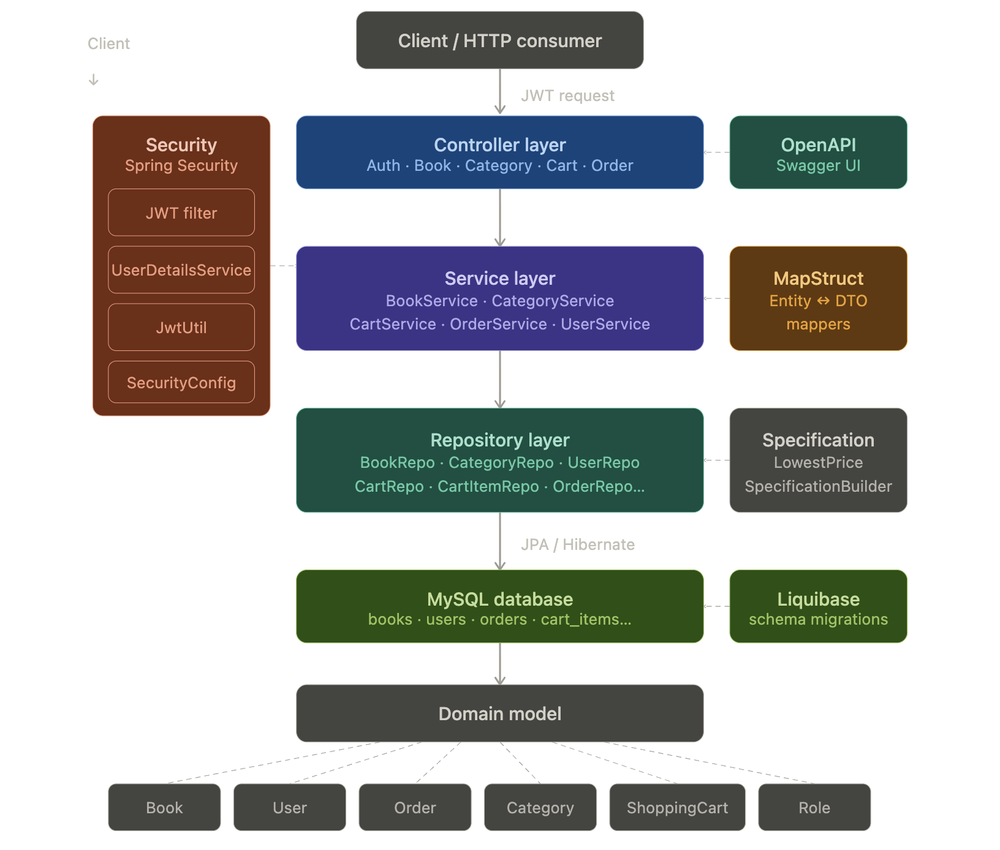

- **Filter layer** - client sends every request with a JWT bearer token. Before anything reaches the controllers, 
the request passes through the Security filter chain.
- **Controller layer** - holds five REST controllers. They handle HTTP mapping, validate incoming DTOs, and delegate all logic downward.
- **Service layer** - contains the business logic, split by domain.
- **Repository layer** - is built on Spring Data JPA. Each entity has its own repository interface.
- **Database layer** - MySQL, managed entirely by Liquibase. The 11 migration changelogs run on startup and create the schema.
- **Domain model** - sits at the base, shared across all layers - eight entities.

---

## ☁️ AWS Infrastructure

The application is deployed on **Amazon Web Services (AWS)** using a production-style architecture that separates compute, database, security, and container registry responsibilities.

### AWS Services Used

| Service | Purpose in This Project |
|---------|--------------------------|
| **EC2** | Hosts the running Spring Boot Docker container and exposes the public API / Swagger UI |
| **RDS (MySQL)** | Managed relational database used to persist users, books, carts, and orders |
| **IAM** | Controls secure access to AWS resources through users, permissions, and CLI credentials |
| **ECR Public** | Stores and distributes the Docker image used to deploy the application |
| **Security Groups** | Firewall rules controlling inbound HTTP traffic to EC2 and MySQL traffic to RDS |

---

## ✨ Features

- **Authentication** - Register and login with JWT token issuance
- **Book Management** - Full CRUD for books, with search/filter by price and other parameters (Admin only for write operations)
- **Category Management** - Organize books into categories (Admin only for write operations)
- **Shopping Cart** - Add, update, and remove books from a personal cart
- **Order Management** - Place orders from cart, view order history and items, update order status (Admin)
- **Role-Based Access Control** - `USER` and `ADMIN` roles enforced at endpoint level
- **Soft Deletes** - Entities are never physically removed; `is_deleted` flags ensure data integrity
- **API Documentation** - Swagger UI available at `/swagger-ui.html` or [this link](http://ec2-16-170-247-139.eu-north-1.compute.amazonaws.com/api/swagger-ui/index.html#/)

---

## Getting Started

### Prerequisites

- Java 17
- Maven
- Docker & Docker Compose
- MySQL

### Clone & Run

```bash
git clone https://github.com/your-username/online-book-store.git
cd online-book-store
```

Set up your `.env` file (see [Environment Variables](#environment-variables)), then:

```bash
# 1. Build the JAR
mvn clean package

# 2. Start the Docker container
docker-compose up
```

The API will be available at:
```
http://localhost:{SPRING_LOCAL_PORT}/api
```

For example, with `SPRING_LOCAL_PORT=4040`:
```
http://localhost:4040/api/swagger-ui/index.html
```

---

## Environment Variables

Create a `.env` file in the project root. Use the template below as a guide:

```.env_template
MYSQLDB_USER=template_user
MYSQLDB_ROOT_PASSWORD=template_password
MYSQLDB_DATABASE=template_database
MYSQLDB_LOCAL_PORT=3303
MYSQLDB_DOCKER_PORT=3306
SPRING_LOCAL_PORT=4040
SPRING_DOCKER_PORT=8080
DEBUG_PORT=5005
```

A `.env_template` file is included in the repository with these example values.

> 📌 `SPRING_LOCAL_PORT` determines the port your endpoints are served on locally.

---

## API Reference

All endpoints are prefixed with `/api`. There are **23 endpoints** in total.

### Authentication

| Method | Path        | Action                         | Required Fields                                                   | Auth   |
|--------|-------------|--------------------------------|-------------------------------------------------------------------|--------|
| POST   | `/register` | Register a new user            | `email`, `firstName`, `lastName`, `password`, `repeatPassword`    | PUBLIC |
| POST   | `/login`    | Log in and receive a JWT token | `email`, `password`                                               | PUBLIC |

### Categories

| Method | Path                              | Action                       | Required Fields | Optional Fields | Auth       |
|--------|-----------------------------------|------------------------------|-----------------|-----------------|------------|
| POST   | `/categories`                     | Create a new category        | `name`          | `description`   | ROLE_ADMIN |
| GET    | `/categories`                     | Get all categories           | —               | —               | ROLE_USER  |
| GET    | `/categories/{category_id}`       | Get category by ID           | —               | —               | ROLE_USER  |
| PUT    | `/categories/{category_id}`       | Update category by ID        | `name`          | `description`   | ROLE_ADMIN |
| DELETE | `/categories/{category_id}`       | Delete category by ID        | —               | —               | ROLE_ADMIN |
| GET    | `/categories/{category_id}/books` | Get all books in a category  | —               | —               | ROLE_USER  |

### Books

| Method | Path               | Action                     | Required Fields                                   | Optional Fields             | Auth       |
|--------|--------------------|----------------------------|---------------------------------------------------|-----------------------------|------------|
| POST   | `/books`           | Create a new book          | `author`, `title`, `isbn`, `price`, `categoryIds` | `description`, `coverImage` | ROLE_ADMIN |
| GET    | `/books`           | Get all books              | —                                                 | —                           | ROLE_USER  |
| GET    | `/books/{book_id}` | Get book by ID             | —                                                 | —                           | ROLE_USER  |
| PUT    | `/books/{book_id}` | Update book by ID          | `author`, `title`, `isbn`, `price`, `categoryIds` | `description`, `coverImage` | ROLE_ADMIN |
| DELETE | `/books/{book_id}` | Delete book by ID          | —                                                 | —                           | ROLE_ADMIN |
| GET    | `/books/search`    | Search books by parameters | —                                                 | query params                | ROLE_USER  |

### Shopping Cart

| Method | Path                                  | Action                        | Required Fields      | Auth      |
|--------|---------------------------------------|-------------------------------|----------------------|-----------|
| POST   | `/cart`                               | Add a book to the cart        | `bookId`, `quantity` | ROLE_USER |
| GET    | `/cart`                               | Get the current user's cart   | —                    | ROLE_USER |
| PUT    | `/cart/cart-items/{cart_item_id}`     | Update cart item quantity     | `quantity`           | ROLE_USER |
| DELETE | `/cart/cart-items/{cart_item_id}`     | Remove an item from the cart  | —                    | ROLE_USER |

### Orders

| Method | Path                                   | Action                             | Required Fields   | Auth       |
|--------|----------------------------------------|------------------------------------|-------------------|------------|
| POST   | `/orders`                              | Place a new order                  | `shippingAddress` | ROLE_USER  |
| GET    | `/orders`                              | Get all orders for current user    | —                 | ROLE_USER  |
| PATCH  | `/orders/{order_id}`                   | Update order status                | `status`          | ROLE_ADMIN |
| GET    | `/orders/{order_id}/items`             | Get all items in an order          | —                 | ROLE_USER  |
| GET    | `/orders/{order_id}/items/{item_id}`   | Get a specific item from an order  | —                 | ROLE_USER  |

---

## Security

Authentication uses **JWT Bearer tokens**.

1. Register at `POST /api/register` or login at `POST /api/login`
2. Copy the `token` value from the response
3. Add it as a header to all subsequent requests:
   ```
   Authorization: Bearer <your_token_here>
   ```

### Authentication Flow Diagram
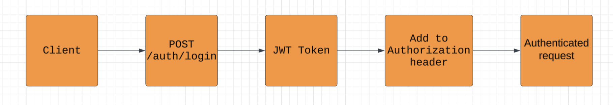

**Role permissions:**

| Role       | Capabilities                                                                        |
|------------|-------------------------------------------------------------------------------------|
| PUBLIC     | Register, Login                                                                     |
| ROLE_USER  | Browse books & categories, manage own shopping cart & orders                        |
| ROLE_ADMIN | Everything ROLE_USER can do + manage books, categories, and order statuses          |

> 🔑 Any user whose email contains `admin@` is automatically granted `ROLE_ADMIN` on registration.

---
## Usage Flow Diagram

Diagram showing a simple use case of the application
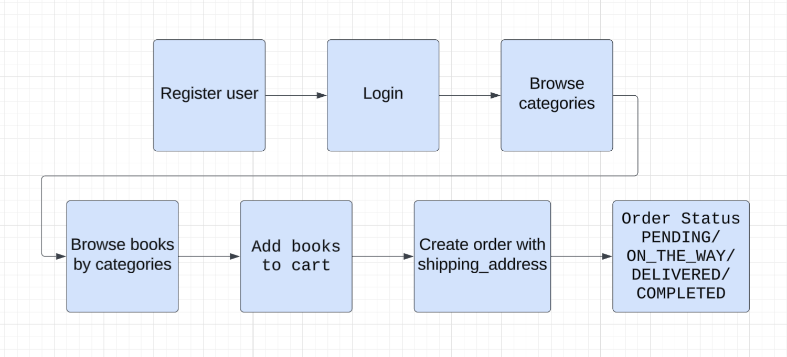

## Database Schema

The database is managed by **Liquibase**. Key tables include:

| Table           | Description                                          |
|-----------------|------------------------------------------------------|
| `users`         | User credentials and profile data                    |
| `roles`         | `ROLE_USER`, `ROLE_ADMIN`                           |
| `user_roles`    | Join table (users ↔ roles)                          |
| `books`         | Title, author, ISBN, price, cover image              |
| `categories`    | Name and description                                 |
| `book_category` | Many-to-many join table (books ↔ categories)        |
| `shopping_carts`| One cart per user                                    |
| `cart_items`    | Book + quantity, linked to a shopping cart           |
| `orders`        | Shipping address, status, user reference             |
| `order_items`   | Snapshot of books and quantities at time of order    |

### LogiPhysical Model

The diagram shows a complete view over entities and their relations.

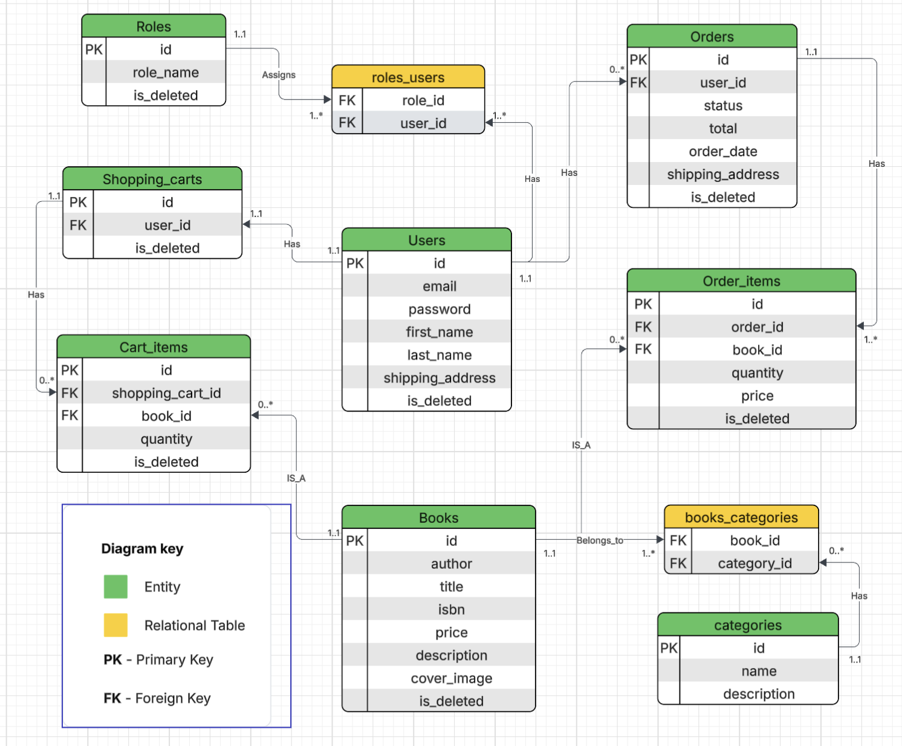

---

## Tests

The project includes tests covering **92% of code lines** across the application.

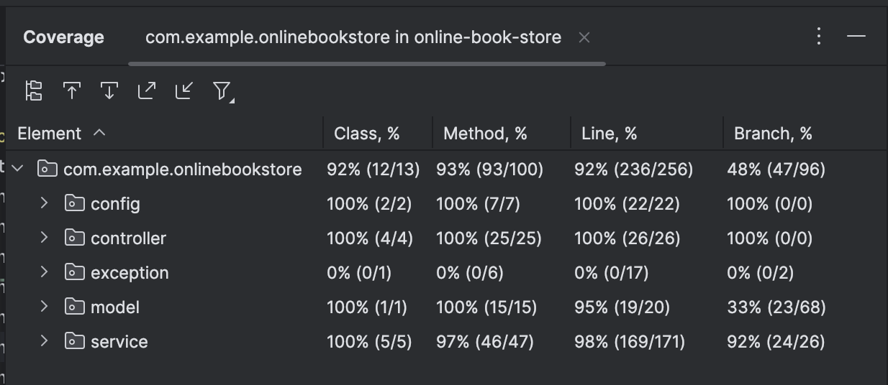

To run all tests run this command: 

```bash
mvn test
```

Tests are written with **JUnit 5** and cover the service, repository, and controller layers.

---

## Swagger UI

Interactive API documentation is available when the application is running.

**Locally:**
```
http://localhost:{SPRING_LOCAL_PORT}/api/swagger-ui/index.html
```

**Live (AWS):**
```
http://ec2-16-170-247-139.eu-north-1.compute.amazonaws.com/api/swagger-ui/index.html#/
```

### Examples with Swagger UI

**Create new user request**

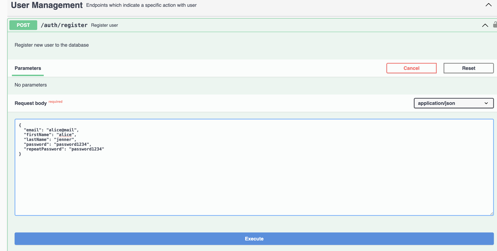

**Create new user response**

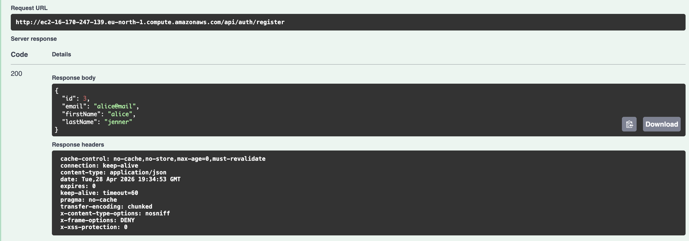

**Login request**

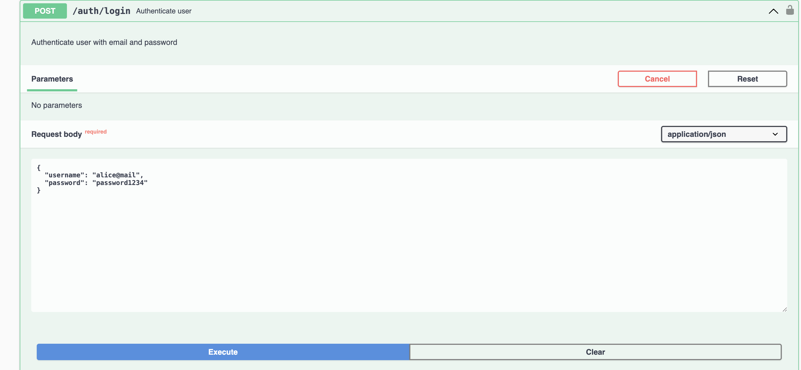

**Login response**

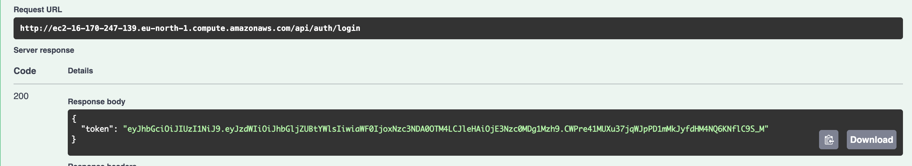

**Authorization JWT Token**

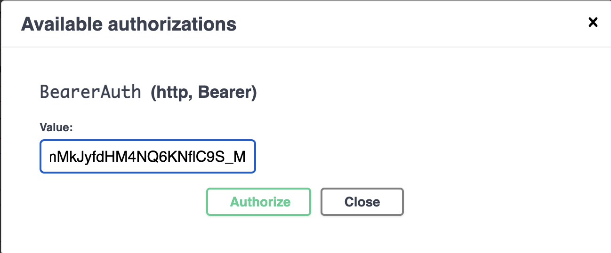

**List all categories request**

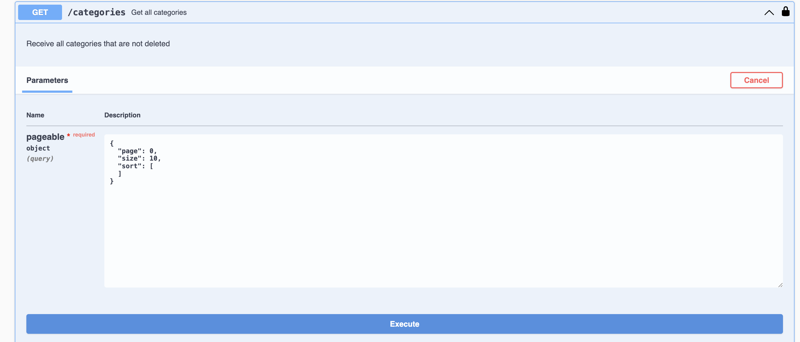

**List all categories response**

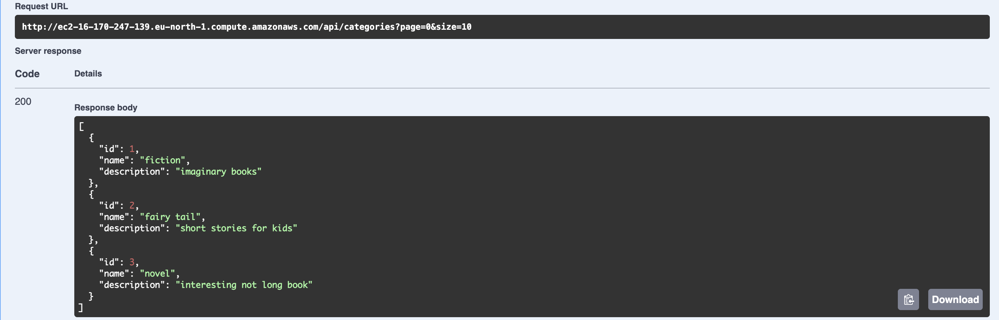